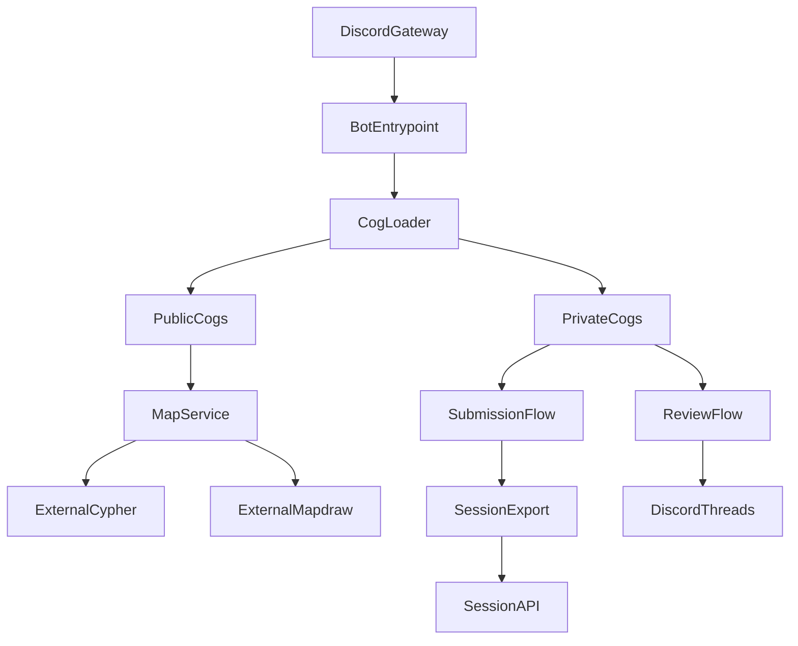

# Contexto do bot xero3.0

## Objetivo

Este documento descreve a arquitetura, fluxos e integrações do bot Discord xero3.0
para apoiar melhorias contínuas com entendimento rápido do domínio.

## Visão geral

- Entrypoint em `bot.py` inicializa o `commands.Bot`, carrega cogs, registra views
  persistentes e (opcionalmente) sobe a Session API local.
- Os comandos são organizados por cogs públicos e privados; cogs privados só
  são publicados em guilds configuradas por `PRIVATE_SERVER_IDS`.
- O bot integra com serviços externos para consultar dados de mapas, renderizar
  previews e publicar resultados.

## Arquitetura (alto nível)

### Componentes principais

- `bot.py`: cria o bot, registra views persistentes e inicia a Session API.
- `app/cogs_loader.py`: descobre e carrega automaticamente cogs em
  `cogs/public` e `cogs/private` (ignora arquivos de teste).
- `app/sync.py`: sincroniza comandos globais e privados (por guild).
- `app/session_api.py`: API HTTP local para exportar sessão e postar reviews.

## Comandos (cogs)

### Públicos (`cogs/public`)

- `/map_info`: busca metadados do mapa, renderiza preview (PNG) via Mapdraw.
- `/report_map`: abre um relatório no canal interno de reports com imagem,
  razão e metadados.

### Privados (`cogs/private`)

- `/map_xml`: baixa o XML de um mapa e entrega como arquivo.
- `/setup_submissions`: cria/atualiza painéis de submissão por categoria
  no canal `session_manager`.

### Tarefas em background

- `ReviewPoster` (`cogs/private/review_poster.py`): a cada 30 minutos, executa
  atualização de reviews no Discord a partir do fórum.

## Fluxos principais

### Submissões por sessão (painéis e threads)

1. `setup_submissions` cria painéis no `session_manager` para cada categoria.
2. Cada painel referencia um thread de submissão por categoria (forum).
3. Início/fim de sessão são marcados por mensagens “Session #X Started/Finished”.
4. O histórico do thread é escaneado para coletar mapas, respeitando limites
   por usuário e ignorando duplicados.
5. Exportações podem ser feitas em JSON (para ferramentas externas).

### Review e fechamento da sessão

- `submit_review_and_close_session` aceita um JSON com resultados e:
  - publica o review no thread ativo;
  - envia o marcador de final de sessão;
  - limpa o painel e opcionalmente inicia a próxima sessão.

### Session API (HTTP local)

Habilitada por `SESSION_API_ENABLED`, oferece endpoints:

- `GET /session` e `GET /session/{category}`: exporta sessão atual em JSON.
- `POST /session/review` e `POST /session/{category}/review`: publica review
  e encerra sessão.
- `GET /auth`: valida token de autenticação e retorna info do usuário.

Pode exigir token via `SESSION_API_TOKEN` (header `Authorization: Bearer ...`).

## Serviços e integrações externas

### Serviços internos

- `service/map_service.py`: fachada para buscar mapas e gerar imagens.
- `service/api_service.py`: integração com a API de mapas (Cypher).
- `service/http_client.py`: utilitários HTTP e sessão compartilhada.

### Serviços externos (URLs)

- `CYPHER_URL`: API de mapas (ex.: dados/metadata do mapa).
- `MAPDRAW_URL`: serviço de renderização de imagens de mapas.
- `WEBHOOK_URL`: endpoint para webhooks internos.
- `STATUS_URL` e `MAPDRAW_STATUS_URL`: healthchecks / status.

## Configuração e variáveis de ambiente

### Essenciais

- `DISCORD_TOKEN`: token do bot.

### Comandos privados

- `PRIVATE_SERVER_IDS`: lista CSV de IDs de guilds para comandos privados.

### Outros parâmetros

- `COMMAND_PREFIX`: prefixo opcional para comandos de texto.
- `DEBUG`: ativa logs mais detalhados.
- `CYPHER_URL`, `MAPDRAW_URL`, `WEBHOOK_URL`, `STATUS_URL`,
  `MAPDRAW_STATUS_URL`.

### Session API

- `SESSION_API_ENABLED`: ativa a API local.
- `SESSION_API_HOST` e `SESSION_API_PORT`: host/porta da API.
- `SESSION_API_TOKEN`: token de autorização.
- `SESSION_API_AUTO_CREATE_NEXT_SESSION`: cria automaticamente a próxima sessão
  ao finalizar uma review via API.

## Canais e recursos

IDs de canais e fóruns são centralizados em `resources/channels.py`, incluindo:

- canais públicos (ex.: `rotation`, `racing`, `map_info`);
- canais internos (`mc_reports`, `mc_discussion`, `mc_auth`, etc.);
- `session_manager` para painéis de submissão;
- fóruns de submissão por categoria.

Listas auxiliares como categorias, emojis e tags vivem em `resources/`.

## Observações operacionais

- Sincronização de slash commands ocorre no `on_ready` via `app/sync.py`.
- Views persistentes são registradas no start (ex.: botões do painel).
- Para publicar comandos sem subir o bot, use `deploy_commands.py`.
- Deploy (Render): worker/VM com `python bot.py`.

